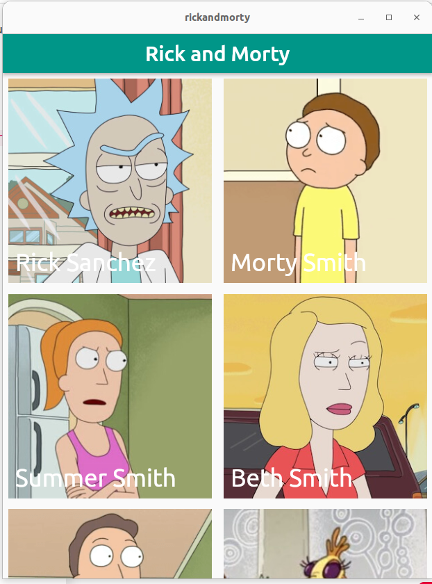

# 0x01. Flutter - Flutter Intro
 

### Resources

* [Rick and Morty API](https://rickandmortyapi.com/)
* [List View Flutter](https://www.geeksforgeeks.org/listview-builder-in-flutter/)
* [Grid View Flutter](https://www.kindacode.com/article/flutter-gridview-builder-example/)
* [Future Builder](https://api.flutter.dev/flutter/widgets/FutureBuilder-class.html)

#### The Rick and Morty project is a fictional example of a mobile app based on the popular animated TV show "Rick and Morty." It's a demo application built using Flutter, a popular cross-platform framework for creating mobile apps. The project showcases various features commonly found in mobile apps, such as fetching data from an API, displaying images and text, navigating between screens, and using widgets to build user interfaces.

#### Here's an overview of the key components of the Rick and Morty project:

* Models: The models.dart file contains the Character class that represents a character from the Rick and Morty universe. It has attributes like name, img, and id, and a fromJson constructor to create a Character object from a JSON map.

* HomeScreen: The HomeScreen widget serves as the main screen of the app. It uses the FutureBuilder widget to asynchronously fetch a list of characters from the Rick and Morty API. The fetched characters are displayed in a GridView using the CharacterTile widget.

* CharacterTile: The CharacterTile widget is used to display an individual character in the GridView. It shows the character's image, name, and uses a GestureDetector to navigate to the EpisodesScreen when the character image is tapped.

* EpisodesScreen: The EpisodesScreen widget is used to display a list of episodes for a specific character. It receives the character's id as a parameter and fetches the episodes for that character using another API call.

* API Calls: The app makes API calls to the Rick and Morty API using the http package to fetch the characters and episodes data. It then parses the JSON responses and maps them to the corresponding model classes.

* Navigation: The app uses the Navigator to handle screen navigation. When a character's image is tapped in the CharacterTile, it navigates to the EpisodesScreen with the corresponding character's id.

###### Overall, the Rick and Morty project demonstrates how to build a simple mobile app that interacts with a RESTful API, fetches and displays data, and uses navigation to move between screens. It's a great example for beginners to understand the basics of mobile app development with Flutter.

### Made by [Jaafar Fares](https://jaafarfares.github.io/) for [Holberton School](https://www.holbertonschool.com/)
